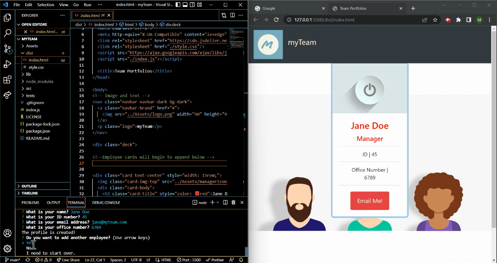
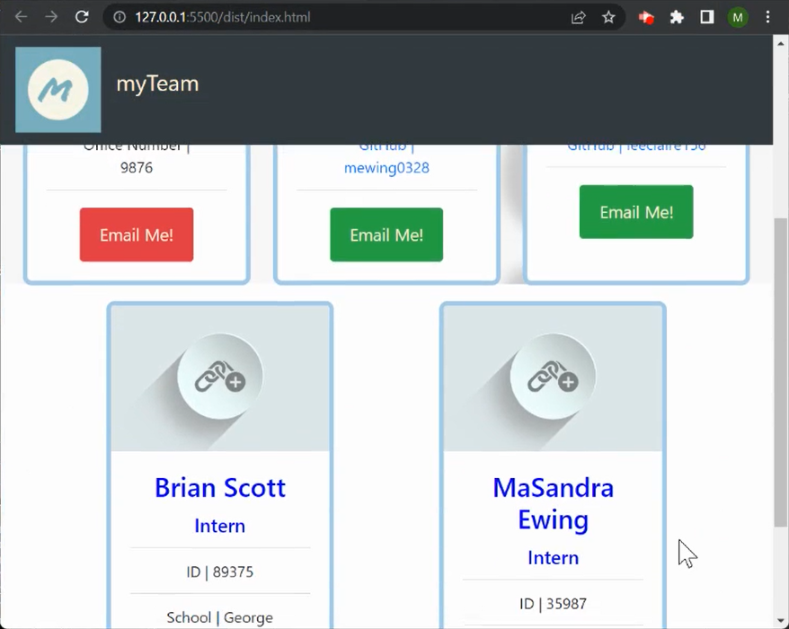
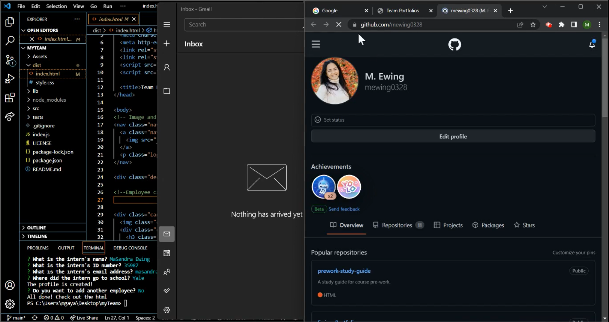

# myTeam
[](https://opensource.org/licenses/MIT)

## Description
A Node.js command-line application that takes in information about employees on a software engineering team, then generates an HTML webpage that displays summaries for each person. 

## Table of Contents
[1. Installation](#installation)

[2. Usage](#usage)

[3. Demo](#demo)

[4. Contributing](#contributing)

[5. Tests](#tests)

[6. Questions](#questions)

[7. License](#license)

[8. Screenshots](#screenshots)

[9. Credits](#credits)

<br></br>

## Installation 
The application has dependencies (see package.json file). Before using the application, install npm modules.

Code for bash below or watch the [demo](https://watch.screencastify.com/v/ysbU11ex258EHuNbCyB4) video.

```bash
npm install
```

## Usage 
The application will be invoked by using the following command:

```bash
node index.js
```

```
Then a command-line application will appear.
Also, an index.html file is created. 

- When the Manager (the user) starts the application, then the user will be prompted to enter the team manager’s name, employee ID, email address, and office number

- When the user enters the team manager’s name, employee ID, email address, and office number, then the user is presented with a menu with the option to add an engineer or an intern or to finish building my team

- When the user selects the engineer option, then the user is prompted to enter the engineer’s name, ID, email, and GitHub username, and the user is taken back to the menu

- When the user selects the intern option, the user is prompted to enter the intern’s name, ID, email, and school, and the user is taken back to the menu

- When the user decides to finish building my team, then the user exits the application, and the HTML is generated

- After all entries are entered, an HTML file is generated that displays a nicely formatted team roster based on the user input

- When the user clicks on an email address in the HTML, the user's default email program opens and populates the TO field of the email with the address

- When the user clicks on the GitHub username, then that GitHub profile opens in a new tab

- The user also has the option to start over and clear the employee cards.

```

## Demo
[Link for demo video](https://watch.screencastify.com/v/ysbU11ex258EHuNbCyB4) (Length of video: 4 minutes and 27 seconds)

The video is also within the assets folder named "myTeam Demo.mp4".

A walkthrough video that demonstrates: 
- the functionality of the myTeam generator.
- how the user would invoke the application from the command line.
- how the user would enter responses to all of the prompts in the application.
- the application pushes employee cards into the [HTML file](./dist/index.html) and applies the [CSS](./dist/style.css) styling to those cards.


## Contributing 
Contributions are welcomed for future versions with features such as:
- saving all the previous cards in a database and then fetching so the user can come back and add more employees in the future in addition to the previously inputted cards (persistent data)
- additional enhancements

For all contributions, please refer to [Contributor Covenant Code of Conduct](https://www.contributor-covenant.org/version/2/1/code_of_conduct/code_of_conduct.md) for contributing guidelines.

## Tests 
The tests will be invoked by using the following command:
```bash
npm run test
```
As per [Jest wesbite](https://jestjs.io/), "Jest is a JavaScript testing framework designed to ensure correctness of any JavaScript codebase. It allows you to write tests with an approachable, familiar and feature-rich API that gives you results quickly."

## Questions
Interested in seeing my other work?

Check out my GitHub account: [mewing0328](https://github.com/mewing0328).

If you have additional questions, please reach me at [masandraewing@gmail.com](mailto:masandraewing@gmail.com).

## License 
myTeam project is covered by MIT license. 

 To view the most current and full license description in opensource.org, click on the license name below.  

 [](https://opensource.org/licenses/MIT)

 ## Screenshots 
Utilized Visual Studio Code

1. Demo of tests passed, node index initiating the application, index.html file created in the dist folder.

    

2. Answer the questions within the terminal prompts - utilizes the [Inquirer 8.2.4](https://www.npmjs.com/package/inquirer/v/8.2.4) package from [npm.Inc.].(https://www.npmjs.com/) to obtain the user inputs. THEN a profile is created.

    

3. User can start over and doing so will clear the index.html of employee profiles.

    

4. After all questions are answered, the application pushes employee cards into the [HTML file](./dist/index.html) and applies the [CSS](./dist/style.css) styling to those cards. <br> <br>Screenshots to show responsive to screen size.

    
    

5. When the user clicks on an email address in the HTML, the user's default email program opens and populates the TO field of the email with the address

    


6. When the user clicks on the GitHub username, then that GitHub profile opens in a new tab

        


## Credits
Credit for tutorials and guides I utilized in my code

[npm](https://remarkablemark.org/blog/2021/08/28/how-to-create-npm-package-lockfile/): How to create a package-lock.json

[node.js](https://nodejs.dev/en/learn/writing-files-with-nodejs/): How to append to an existing file.

[inquirer npm](https://www.npmjs.com/package/inquirer): Inquirier to ask and get the user inputs.

[jestjs.io](https://jestjs.io/docs/getting-started): Jest documentation to create my test.js files

[Bootstrap](https://getbootstrap.com/): CSS styling

[Call the Superclass Constructor](http://www.beginwithjava.com/java/inheritance/calling-the-superclass-constructor.html): How to utilize the Employee constructor to the Engineer, Manager, and Intern js files.

[window.open](https://www.geeksforgeeks.org/how-to-open-url-in-new-tab-using-javascript/): Open the GitHub on a new page

[Open Email in Default Mail App](https://stackoverflow.com/questions/4994954/open-default-mail-client-with-a-link)

[pixabay](https://pixabay.com/): Images rendered on the html page

[pixabay](https://pixabay.com/the users/ivke32-2526695/): This account for the icons for each employee card
